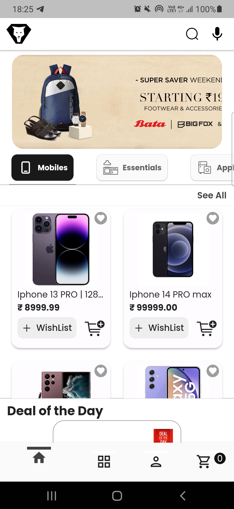

## Few Screenshots 

| Sign up | Sign in |
| ------------------ | ------------------ |
|   |   |
  

| Home | Categories | Cart | Checkout |
| ------------------ | ------------------ | ------------------ | ------------------ |
|   |   |   |   |

| Pay now | Payment gateway (Razorpay) | Payment success | Order placed |
| ------------------ | ------------------ | ------------------ | ------------------ |
|   |   |   |   |

| Orders | Order details | Chatbot(1) | Chatbot(2) |
| ------------------ | ------------------ | ------------------ | ------------------ |
|   |   |   |   |

| Profile picture | 
| ------------------ |
|   | 

| Search suggestions | Search history | Search via audio | 
| ------------------ | ------------------ | ------------------ | 
|   |   |   | 

## Features

- User
  - Email and password authentication
  - Search | Search history
  - Filters
  - Categories
  - Rating
  - Deal of the Day
  - Cart integration
  - Payment integration with Razorpay API
  - Chatbot (Customer Support)
  - Order history
  - Track order status
  - Sign out
- Admin 
    - Product Management (View | Add | Delete Products)
    - Order Management (View | Update Orders)
    - Sales Analytics (View Total Sales | Sales Graphs)
 
 ## Technologies used
 |**Server**| **Client** | **Database** | **SAAS (media assets)** |  
 | ------------------ | ------------------ | ------------------ | ------------------ |
 | [Nodejs](https://nodejs.org/en/docs), [Expressjs](https://expressjs.com/) | [Flutter](https://docs.flutter.dev/) | [MongoDB](https://www.mongodb.com/docs/) | [Cloudinary](https://cloudinary.com/documentation) | 
 
 npm packages used : [jsonwebtoken](https://www.npmjs.com/package/jsonwebtoken), [bcryptjs](https://www.npmjs.com/package/bcryptjs), [mongoose](https://www.npmjs.com/package/mongoose)
 
 Chatbot : [DialogFlow](https://cloud.google.com/dialogflow/docs)
 
 State management : [Provider](https://pub.dev/packages/provider)
 
 ___
 
 #### I hope this repository will be helpful to flutter developers. Feel free to reach out to me in case you have any queries or feedback.
